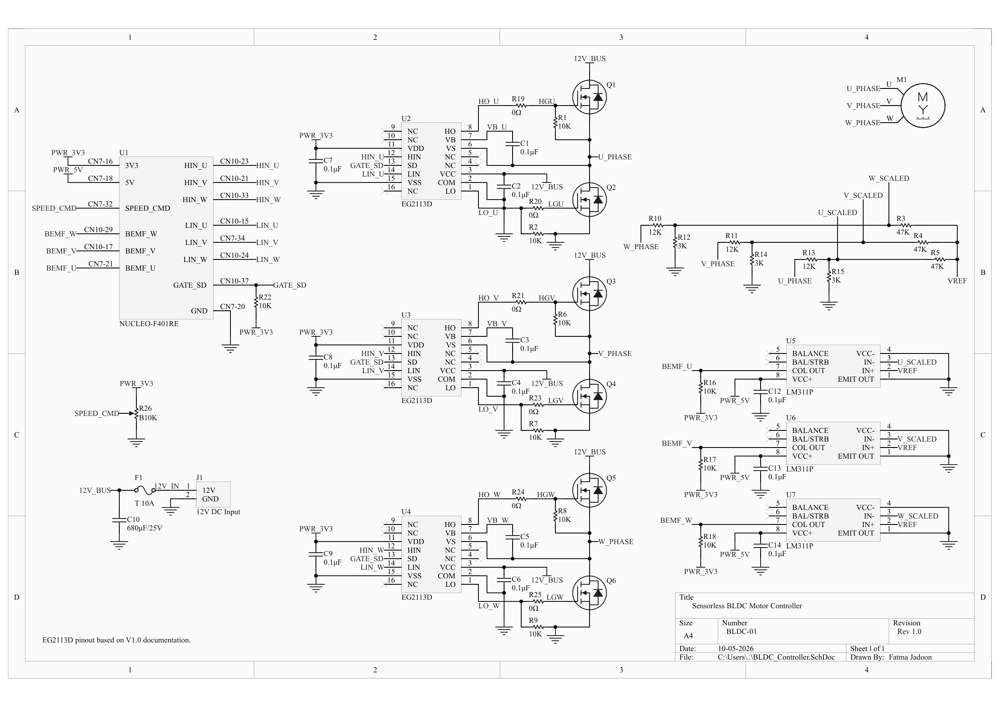

# Sensorless BLDC Motor Controller
12V sensorless three-phase BLDC motor controller designed around an STM32 NUCLEO-F401RE. 

## Tools
- Altium Designer
- STM32 NUCLEO-F401RE
- STM32CubeIDE
- C

## Schematic

## Features
The current hardware revision includes:
- Three-phase MOSFET inverter
- EG2113D half-bridge gate-driver circuitry
- Back-EMF zero-cross detection
- Virtual-neutral reference
- Power-input protection
- STM32 control interfaces for PWM, BEMF sensing, shutdown, and speed control

## Hardware (Rev 1)
- 12V DC input
- 10A time-delay fuse
- 680µF/25V DC-link capacitor
- 3 x EG2113D half-bridge gate drivers
- 6 x IRF540N N-channel MOSFETs
- 0Ω configurable gate-resistor footprints
- 10kΩ gate-source pull-downs
- 12kΩ/3kΩ phase-voltage dividers
- 3 x 47 kΩ virtual motor-neutral reference
- 3 x LM311 BEMF comparators
- 3.3V open-collector output pull-ups
- 10kΩ potentiometer for setting speed

## Project Status
**Hardware schematic:** Rev 1 complete  
**STM32 firmware:** In development  
**PCB layout:** In development
